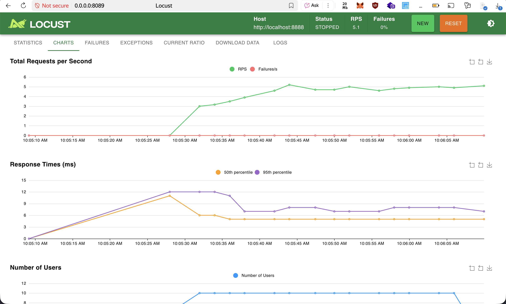
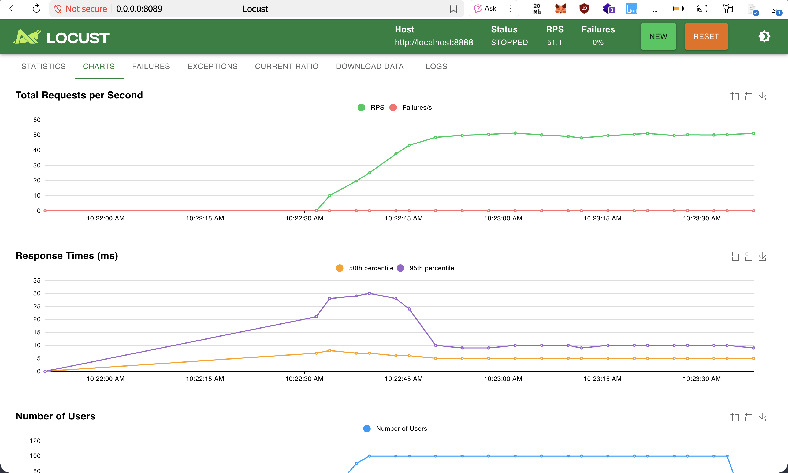
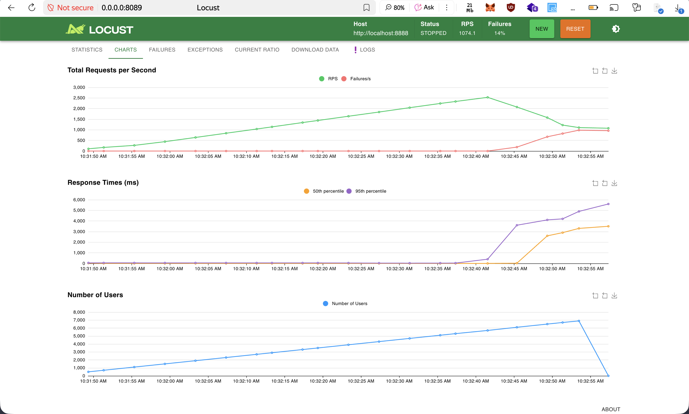

# Atelier 3 - Test de charge
ce projet n'est pas un fork d'un dépôt public , il s'agit d'un de mes projets de classe — un clicker en Golang/Docker que j'ai réutilisé pour réaliser cet atelier .
projet initial : https://hub.docker.com/r/tikhiyzima/clicker

## Scénarios de test
Le fichier `locustfile.py` couvre deux cas :
* **GET** `/api/count` : réception du count .
* **POST** `/api/increment` : incrémentation du clicker .

## Résultats
### Test GET

### Test POST

## Known issues
Voici les observations suite aux tests de charge :
* L'application répond correctement sous une charge de 50 à 100 utilisateurs.
* les temps de réponse restent extrèmement faible ( < 10ms ) 
* aucune erreur critique détectée pour le moment , les temps de réponses sont extrèmement faibles car les endpoints sont extrèmement simplistiques et de par l'utilisation du framework hertz qui est optimisé pour la haute performance
* j'ai réussi à pousser les routes POST jusqu'à du 2529 RPS / 5700 utilisateurs avant d'avoir des requêtes failed 

